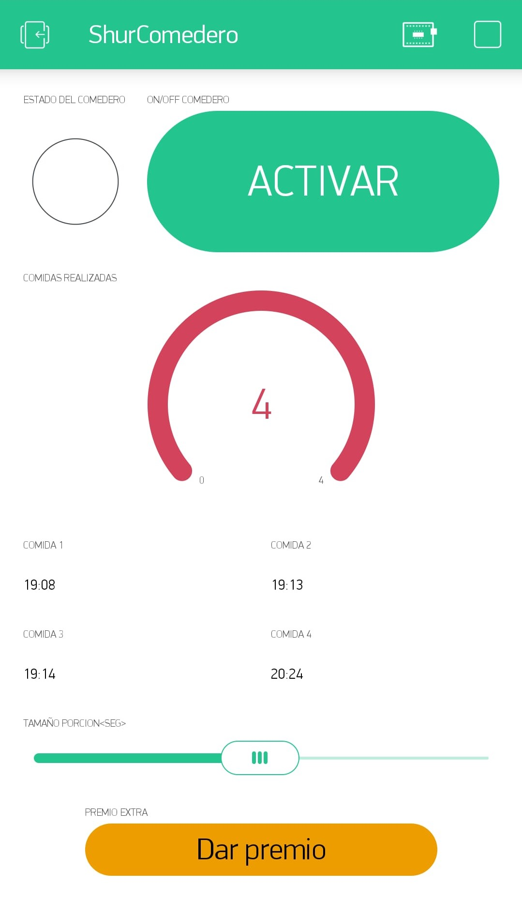

# Dispenser-1.0
by Mahuerta

# DIY Dispenser - Características

- Alimentador automático de mascotas;
- El control se realiza mediante una apliación en la plataforma Blynk o a traves de Telegram;
- Permite programar 4 comidas diarías;
- Permite entregar un premio en cualquier momento del día;
- Permite configurar el tamaño de la porción en segundos;
- Permite ver la cantidad de comidas dosificadas  en el día;

# Dashboard Blynk

- V2: valor por defecto.
- V5: On=1, Off=0;
- V6: 0 a 4;
- V7; On=1, Off=0. Se puede configurar como push o switch;
- V8/V9/V10/V11: valores por defecto;
- V12: se pueden setear valores min y máx cualquiera. En nuestro caso mín=10 y máx=60. Estos son segundos;

# Circuit

## Componentes
- NodeMCU / Wemos D1 mini;
- Servo de rotación continua "Dm-s0090d ";
- Led Azul;
- Resistencia de entre 100 a 220 ohm;

# Code
`<Code>` : <https://github.com/mahuerta/DIY_Dispenser/blob/master/Dispenser_Code_1.0/Dispenser_Code_1.0.ino>

## Librerías
- Blynk: <https://github.com/blynkkk/blynk-library>
- Esp8266: <https://github.com/esp8266/Arduino>
- NTPClient: <https://github.com/arduino-libraries/NTPClient>
- Servo: <https://github.com/arduino-libraries/Servo>
- Universal Telegram: <https://github.com/witnessmenow/Universal-Arduino-Telegram-Bot>

# Links

`<Github>` : <https://github.com/mahuerta>

# End
